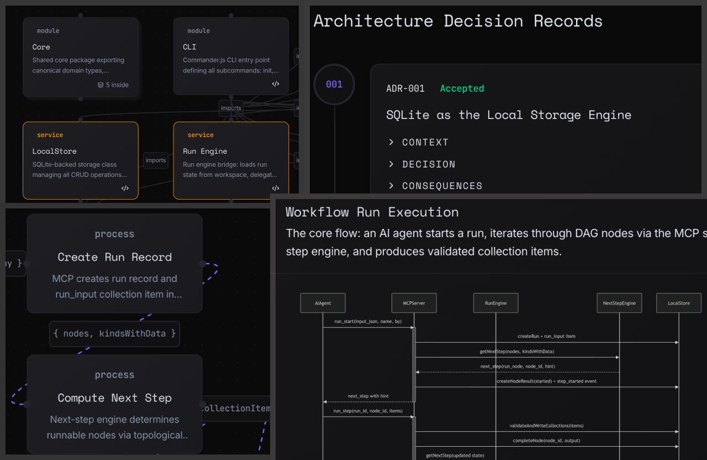

# Interactive Docs Skill

<p align="center">
  
</p>

A Claude Code skill that generates a fully interactive, locally-runnable documentation website from any codebase.

Analyzes your project and produces a React + Vite + TypeScript app with 10 cross-linked views — all populated from real code analysis, not templates or placeholders.

## Views

| View                | What it shows                                                            |
| ------------------- | ------------------------------------------------------------------------ |
| System Overview     | Architecture diagram with layers (client, API, services, data, external) |
| Component Graph     | Module/component hierarchy with drill-down                               |
| Data Flow           | Animated flow diagrams showing data movement                             |
| Sequence Diagrams   | Mermaid sequence diagrams for key flows                                  |
| Entity-Relationship | Data model visualization with entity cards                               |
| State Machines      | Mermaid state diagrams for stateful entities                             |
| API Contracts       | Grouped API endpoints with request/response shapes                       |
| Dependency Graph    | Source file dependencies with circular dependency detection              |
| Tech Stack          | Technology inventory grouped by category                                 |
| ADRs                | Timeline of architectural decisions                                      |

All views are cross-linked — clicking an entity in one view navigates to related entities in other views.

## Installation

### Option 1: Plugin Install (Recommended)

Inside Claude Code, run:

```
/plugin marketplace add adamyodinsky/interactive-docs-skill
/plugin install interactive-docs
```

The skill becomes available as `/interactive-docs`.

### Option 2: Manual Install (Personal Skill)

```bash
git clone https://github.com/adamyodinsky/interactive-docs-skill.git ~/.claude/skills/interactive-docs-skill
ln -s ~/.claude/skills/interactive-docs-skill/skills/interactive-docs ~/.claude/skills/interactive-docs
```

The skill becomes available as `/interactive-docs`.

### Option 3: Project-Local Install

Clone into your project's `.claude/skills/` directory:

```bash
cd your-project
git clone https://github.com/adamyodinsky/interactive-docs-skill.git .claude/skills/interactive-docs-skill
ln -s .claude/skills/interactive-docs-skill/skills/interactive-docs .claude/skills/interactive-docs
```

## Usage

```
/interactive-docs /path/to/your/project
```

Or from within a project directory:

```
/interactive-docs .
```

The generated site will be created at `<project-root>/<project-name>-docs/`. Run it with:

```bash
cd <project-name>-docs
yarn dev
```

## Prerequisites

- **Node.js** 18+
- **yarn** or **npm**
- **Claude Code** with sufficient context for your project size

## How It Works

The skill runs through 8 sequential phases:

1. **Resolve** — Validate project path and set up variables
2. **Analyze** — Static analysis: languages, frameworks, dependencies, file structure
3. **Explore** — AI reads source code and produces a structured project analysis
4. **Scaffold** — Create the Vite + React + TypeScript + Tailwind documentation site
5. **Build** — Two parallel agents: one generates data files, the other builds React components
6. **Validate** — TypeScript build check with iterative error fixing
7. **Visual Test** — Playwright tests verify all 10 views render correctly
8. **Polish** — AI-driven design refinement for professional output

## Supported Languages

Works with any codebase. Has enhanced detection for: JavaScript/TypeScript, Python, Go, Rust, Ruby, Java, Kotlin, Swift, Dart, C/C++, C#, PHP, Elixir, Scala, Haskell, OCaml, Zig, Lua, and more.

## Contributing

See [CONTRIBUTING.md](CONTRIBUTING.md) for guidelines.

## Star History

[](https://star-history.com/#adamyodinsky/interactive-docs-skill&Date)

## License

[MIT](LICENSE)
